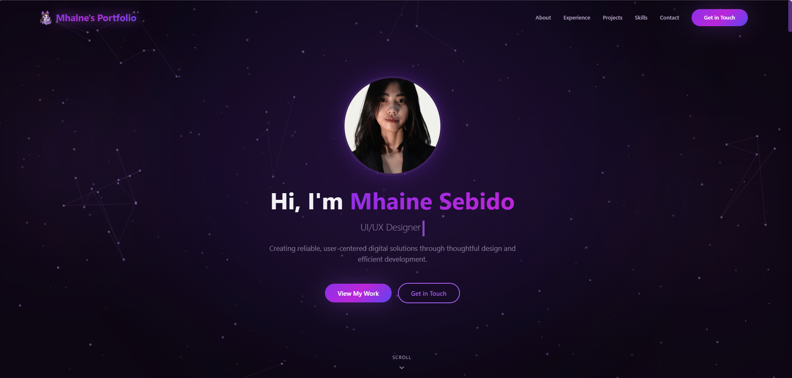

# Hi there, I'm Mhaine! 

<a href="https://github.com/Readme-Workflows/readme-typing-svg">
  <picture>
    <source media="(prefers-color-scheme: dark)" srcset="https://readme-typing-svg.demolab.com?font=Fira+Code&weight=600&size=26&pause=1000&color=ffffff&center=true&vCenter=true&width=600&lines=UI%2FUX+Designer;Front-end+Developer">
    <source media="(prefers-color-scheme: light)" srcset="https://readme-typing-svg.demolab.com?font=Fira+Code&weight=600&size=26&pause=1000&color=000000&center=true&vCenter=true&width=600&lines=UI%2FUX+Designer;Front-end+Developer">
    
  </picture>
</a>

I'm a <b>3rd-year college student</b> deeply passionate about graphic design, UI/UX, and front-end development. I specialize in bridging the gap between aesthetic design and functional code.

  

 

### 🛠️ Tech Stack & Tools

 

 

 

 

### 🌐 My Website

  Visit my website <a href="https://mhainems.vercel.app/" style="color: #000000;"><b>https://mhainems.vercel.app/</b></a>

  

 

 

### 📊 GitHub Stats

  <picture>
    <source media="(prefers-color-scheme: dark)" srcset="https://github-readme-stats.vercel.app/api?username=mhne-seb&show_icons=true&title_color=58a6ff&icon_color=58a6ff&text_color=ffffff&bg_color=00000000&border_color=555555&hide_border=false&border_radius=10">
    <source media="(prefers-color-scheme: light)" srcset="https://github-readme-stats.vercel.app/api?username=mhne-seb&show_icons=true&title_color=000000&icon_color=000000&text_color=000000&bg_color=00000000&border_color=000000&hide_border=false&border_radius=10">
    
  </picture>

  <picture>
    <source media="(prefers-color-scheme: dark)" srcset="https://github-readme-stats.vercel.app/api/top-langs/?username=mhne-seb&layout=compact&title_color=58a6ff&text_color=ffffff&bg_color=00000000&border_color=555555&hide_border=false&border_radius=10">
    <source media="(prefers-color-scheme: light)" srcset="https://github-readme-stats.vercel.app/api/top-langs/?username=mhne-seb&layout=compact&title_color=000000&text_color=000000&bg_color=00000000&border_color=000000&hide_border=false&border_radius=10">
    
  </picture>

   
   

  <picture>
    <source media="(prefers-color-scheme: dark)" srcset="https://github-readme-streak-stats.herokuapp.com/?user=mhne-seb&fire=58a6ff&ring=58a6ff&currStreakLabel=58a6ff&sideNums=ffffff&sideLabels=ffffff&dates=ffffff&background=00000000&border=555555&stroke=555555&hide_border=false&border_radius=10">
    <source media="(prefers-color-scheme: light)" srcset="https://github-readme-streak-stats.herokuapp.com/?user=mhne-seb&fire=000000&ring=000000&currStreakLabel=000000&sideNums=000000&sideLabels=000000&dates=000000&background=00000000&border=000000&stroke=000000&hide_border=false&border_radius=10">
    
  </picture>

 
 

  

